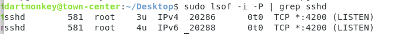
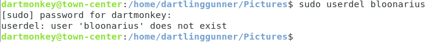
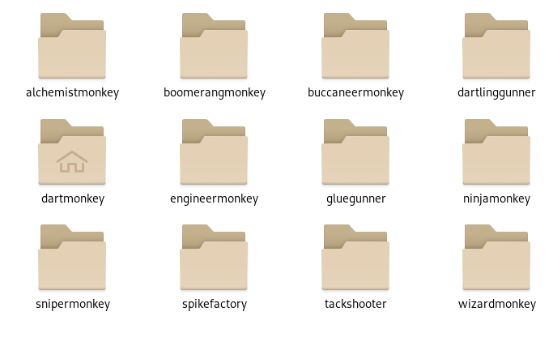

# Bloons TD 6 Writeup

Created by: StageKing (user: stageking5000). Updated version of Mobmaker's original answer key, which can be found at (https://drive.google.com/file/d/15bA9T38Lq7FYhLNJM2CkNV3hUXaga9WL/view).

## Image README

This company's security policies require that all user accounts be password protected. Employees are required to choose secure passwords, however this policy may not be currently enforced on this computer. The presence of any non-work related media files and "hacking tools" on any computers is strictly prohibited. This company currently does not use any centralized maintenance or polling tools to manage their IT equipment. This computer is for official business use only by authorized users. This is a critical computer in a production environment. Please do NOT attempt to upgrade the operating system on this machine.
Debian 10

It is company policy to use only Debian 10 on this computer. It is also company policy to use only the latest, official, stable Debian 10 packages available for required software and services on this computer. Management has decided that the default web browser for all users on this computer should be the latest stable version of Firefox. Company policy is to never let users log in as root. If administrators need to run commands as root, they are required to use the "sudo" command.

This system requires the latest version of OpenSSH. OpenSSH also needs to be secure against outsider threats.

A new monkey has been added to Bloons TD6! The user "engineermonkey" should be added to this system at your earliest convenience.

Critical Services: OpenSSH

Authorized Administrators and Users

Authorized Administrators:
dartmonkey (you) 

password: monkey123!

ninjamonkey

password: Seek!ngShurik3n

boomerangmonkey
	
password: Gl@iveR!coch3t

gluegunner

password: gluesoak

Authorized Users: wizardmonkey, dartlinggunner, snipermonkey, alchemistmonkey, tackshooter, spikefactory, buccaneermonkey


# Forensic Questions

## Forensic Question 1 Correct: 
```

- Instructions:

- 1) Type the answer to the question in place of 
- <Type Answer Here>

- 2) Save the file (you will not get credit until the 
- file is saved)

- Example question (not scored):

- What was the name of the Lone Ranger's horse?

- ANSWER: <Type Answer Here>

- After correctly answering the question, the example 
- question would look like this:

- What was the name of the Lone Ranger's horse?

- ANSWER: Silver

- If the question has more than one answer, place each 
- answer on a separate line, for example:

- What was the name of the Lone Ranger's horse?

- ANSWER: Silver
- ANSWER: Dusty

- Remember to save the file after typing the answer.
- The scored question appears below.

- -------------------------------------------------------- 

User IDs (UIDs) are used to label users, and are a quick
glance at the level of permissions a user may or may not have.

What is the UID of user snipermonkey?

( EXAMPLE: 1001 )

ANSWER: 1006
```
UID stands for User Identifier, which is the unique numerical value assigned by the operating system to every user account. The way to get a UID for a user is to run the id  -u command. So we type id -u snipermonkey into the terminal.

## Forensic Question 2 Correct: 
```

- Instructions:

- 1) Type the answer to the question in place of 
- <Type Answer Here>

- 2) Save the file (you will not get credit until the 
- file is saved)

- Example question (not scored):

- What was the name of the Lone Ranger's horse?

- ANSWER: <Type Answer Here>

- After correctly answering the question, the example 
- question would look like this:

- What was the name of the Lone Ranger's horse?

- ANSWER: Silver

- If the question has more than one answer, place each 
- answer on a separate line, for example:

- What was the name of the Lone Ranger's horse?

- ANSWER: Silver
- ANSWER: Dusty

- Remember to save the file after typing the answer.
- The scored question appears below.

- ===========================================================

This device is configured to run OpenSSH, a common service 
to remotely access systems. The OpenSSH daemon requires an 
open port to talk to the clients through, which is standard
of basically any online service. The port that is set can
often be found in the configuration file of said service.

What is the OpenSSH daemon's port?

( EXAMPLE: ANSWER: 80 )

ANSWER: 4200
```
The easiest way to do it is to check which port the OpenSSH server is listening to rn. To do this, you can run the command sudo lsof -i -P | grep sshd. The Linux command lsof stands for list open files, which in this case lists all the open network connections. The -i filters for only internet and network files. The -P stops the lsof command from showing a port number instead of a service name. Lastly the “grep | sshd” is just using the grep command to search for sshd in the process. And when we run this:



## Forensic Question 3 Correct: 
```

- Instructions:

- 1) Type the answer to the question in place of 
- <Type Answer Here>

- 2) Save the file (you will not get credit until the 
- file is saved)

- Example question (not scored):

- What was the name of the Lone Ranger's horse?

- ANSWER: <Type Answer Here>

- After correctly answering the question, the example 
- question would look like this:

- What was the name of the Lone Ranger's horse?

- ANSWER: Silver

- If the question has more than one answer, place each 
- answer on a separate line, for example:

- What was the name of the Lone Ranger's horse?

- ANSWER: Silver
- ANSWER: Dusty

- Remember to save the file after typing the answer.
- The scored question appears below.

- ===========================================================

Creators of practice images put in a lot of time and effort,
and are probably the only reason that you have niche and
unique competition knowledge. These people work very hard
just to enrich and educate the populus of High School
Cybersecurity.

Who is the creator of this practice image?

( EXAMPLE: ANSWER: Max49 ) <- Username
( EXAMPLE: ANSWER: Max49#9833 ) <- Discord tag

ANSWER: Mobmaker
```
Go to Practice Images spreadsheet (https://docs.google.com/spreadsheets/d/1cdVHtk4w5JDJCYy-EO2_ycr0ZqMgUyjFOVDn5Y8eGVw/edit?gid=0#gid=0), go to Linux tab, and scroll till you see the creator of Bloons TD 6.

# Vulnerabilities:

## Critical Services

### OpenSSH

SSH = Secure Shell, cryptographic network protocol that allows you to securely connect to and manage a remote computer over an unsecured network. 

#### OpenSSH Root Login disabled - 6 pts

Root is the default admin account in Linux and possess total power on a computer. The root user has access to all files, systems, and accounts on a device, so it's important that no one should be able to login remotely into root. You can do this with the command: sudo nano /etc/ssh/sshd_config. There, change the line to "Permit Root Login: no" and not commented out.

## User Auditing
NOTE: For user auditing in Linux, many of the configurations can be done in either the Settings app or the command line. The command line more recommended to build familiarity and comfort with the operating system. Both versions of the solution will be listed for your convenience. 

#### Removed unauthorized user bloonarius - 5 pts

Bloonarius is not an authorized user mentioned in the README for either group, so we can simply assume that it's a gateway into your network. To remove them, we can simply just delete them in Settings app, or from terminal with the command userdel bloonarius. 



#### Removed unauthorized user icemonkey - 5 pts

Icemonkey is not an authorized user mentioned in the README for either group, so again we can safely assume it's another fake user to act as a way into our device. Once again, either delete from the Settings app or from terminal with the command userdel icemonkey.

#### User boomerangmonkey is an admnistrator - 5 pts 

Boomerangmonkey is listed as a user in the administrator group in the README. But in settings and /etc/group, he's listed as a standard user. So in order to make this right, we have to switch him to an administrator. This can be done in settings by clicking on boomerangmonkey in settings and selecting the Administrator button OR in the terminal with sudo usermod -aG sudo
boomerang monkey. 

#### Created user account engineermonkey - 5 pts

In the README, it stated that there is a user called engineermonkey that just joined, so we need to create a profile for that user. This can be done in Settings by pressing Add User and entering the username engineermonkey and adding a password. It can also be done in terminal with the command: sudo adduser engineermonkey. 



## Password Policy 
Passwords are an important part of accounts as they are the primary way of entry. So, they must be of good length (8+ characters), have letters, numbers, and symbols, and be difficult to decipher.

#### Changed insecure password for user gluegunner - 4 pts
By examining the admin passwords, we can see that gluegunner has a very weak password that can be easily guessed by an automated password-cracking system. So, in order to fix this, we can go to Settings, click on gluegunner, and change the password to fulfill the security requirements. If you have a green password, you'll be fine.

# Uncomplicated Firewall (UFW) has been enabled - 6 pts 
UFW is the default firewall in Linux, but it is typically disabled upon fresh installation. 
